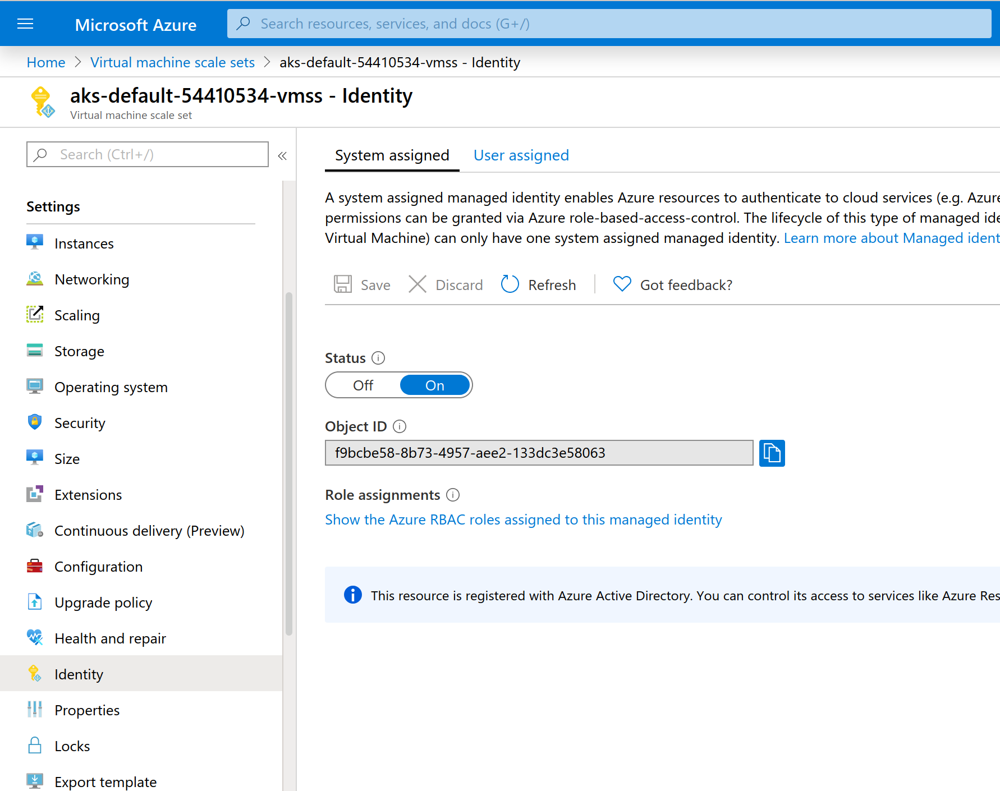

# ATAT Terraform
Welcome! You've found the ATAT IaC configurations.

ATAT is configured using terraform and a wrapper script called `secrets-tool`. With `terraform` we can configure infrastructure in a programatic way and ensure consistency across environments. 

## Directory Structure

**modules/** - Terraform modules. These are modules that can be re-used for multiple environments. 

**providers/** - Specific environment configurations. (dev,production, etc)

# Setup
Install the following requirements.

I highly recommend [tfenv](https://github.com/tfutils/tfenv) which will help you manage versions of TF and install new ones as needed. It gives you the ability to switch back and forth between versions as necessary, especially when doing upgrades and managing multiple environments. Think of it like `pyenv`.

Python is required for the `secrets-tool`. It is used to wrap terraform and pass secrets in to terraform from Azure KeyVault. This approach avoids leaving secrets on the filesystem in any way and allow for restricting access to secrets to specific operators.

Azure CLI is necessary for creating some intial resources, but is also used by the Python Azure SDK to make calls in some cases.

Requirements:
- [tfenv](https://github.com/tfutils/tfenv)
- Python 3.7
- Python pip
- Python virtualenv # FIXME: Switch to `pipenv`
- [azure cli](https://docs.microsoft.com/en-us/cli/azure/install-azure-cli?view=azure-cli-latest)
- [powershell](https://docs.microsoft.com/en-us/powershell/scripting/install/installing-powershell?view=powershell-6) See below

# tfenv
`tfenv` will allow you to install TF versions. For example.

```
tfenv install 0.12.18
```
_0.12.18 at time of writing_


To select a version to use
```
tfenv use 0.12.18
```

# Powershell
Some things you need to use powershell. Specifically getting client profiles for the VPN.

## Install powershell on Linux
Powershell on recent versions of Ubuntu is available through snap.

For Ubuntu 19.10
```
snap install powershell --classic
```

# Preview Features
To create all the resources we need for this environment we'll need to enable some _Preview_ features.

This registers the specific feature for _SystemAssigned_ principals
```
az feature register --namespace Microsoft.ContainerService --name MSIPreview
```

To apply the registration, run the following
```
az provider register -n Microsoft.ContainerService
```

# Running Terraform
First, you'll need to log in to Azure. With the Azure CLI installed, you can run the following.

```
az login
```

Next, you'll need to initialize the environment. This process pulls down the terraform provider module from github as well as pulls in the modules that will be used by this provider/environment setup.

```
cd providers/dev/
terraform init
```

Once initialized, you can run a plan. A `plan` compares the terraform definitions you have configured in the provider directory (Ex. `providers/dev`) with what is in the shared state file in the Azure Object Storage (which all providers are currently configured for). This then also compares it to the state of the services which are running in Azure.

If nothing has been applied, you'll see all the resources defined in terraform as all new with a `+` next to the resource name. If the resource exists, but has changed, you'll see a `~` next to the resource and the delta of the change to be applied.

If you're plan looks good, you can run the apply.
```
terraform apply
```

Check the output for errors. Sometimes the syntax is valid, but some of the configuration may be wrong and only rejected by the Azure API at run time. If this is the case, fix your mistake, and re-run.

# After running TF (Manual Steps)

## VM Scale Set 
After running terraform, we need to make a manual change to the VM Scale Set that is used in the kubernetes. Terraform has a bug that is not applying this as of `v1.40` of the `azurerm` provider.

In order to get the `SystemAssigned` identity to be set, it needs to be set manually in the console.

Navigate to the VM Scale Set for the k8s cluster you're managing (in the console).


_Just click the `Status` to `On`_

## KeyVault Policy
There is a bug (missing feature really) in the `azurerm` terraform provider which exposes the wrong `object_id/principal_id` in the `azurerm_kubernetes_cluster` output. The `id` that it exposes is the `object_id` of the cluster itself, and _not_ the Virtual Machine Scale Set SystemAssigned identity. This needs to be updated manually after running terraform for the first time.

To update, just edit the `keyvault.tf`. Set the `principal_id` to the `object_id` of the Virtual Machine Scale set. This can be found in the Azure portal, or via cli.

```
az vmss list
```
In that list, find the scale set for the k8s cluster you're working on. You'll want the value of `principal_id`.


The error looks like the following
```
  Warning  FailedMount  8s (x6 over 25s)   kubelet, aks-default-54410534-vmss000001  MountVolume.SetUp failed for volume "flask-secret" : mount command failed, status: Failure, reason: /etc/kubernetes/volumeplugins/azure~kv/azurekeyvault-flex
volume failed, Access denied. Caller was not found on any access policy. r nCaller: appid=e6651156-7127-432d-9617-4425177c48f1;oid=f9bcbe58-8b73-4957-aee2-133dc3e58063;numgroups=0;iss=https://sts.windows.net/b5ab0e1e-09f8-4258-afb7-fb17654bc5
b3/ r nVault: cloudzero-dev-keyvault;location=eastus2 InnerError={code:AccessDenied}
```

Final configuration will look like this.
**keyvault.tf**
```
module "keyvault" {
  source       = "../../modules/keyvault"
  name         = var.name
  region       = var.region
  owner        = var.owner
  environment  = var.environment
  tenant_id    = var.tenant_id
  principal_id = "f9bcbe58-8b73-4957-aee2-133dc3e58063"
}
```

# Shutting down and environment
To shutdown and remove an environment completely as to not incur any costs you would need to run a `terraform destroy`.

```
terraform destroy
```

**This will destroy all resources defined in the provider so use with caution!! This will include things like KeyVault, Postgres, and so on. You may lose data!!**

# Advanced Terraform
## Targeted Apply
Sometimes you're writing a new module and don't want to make changes to anything else. In this case you can limit what TF changes.

```
terraform plan -target=module.vpc
```

In the above example, this will only run a plan (plan/apply/destroy) on the specific module. This can be a module, or resource. You can get a list of module and resources by running `terraform show`.

# VPN Setup
[Configure OpenVPN clients for Azure VPN Gateway](https://docs.microsoft.com/en-us/azure/vpn-gateway/vpn-gateway-howto-openvpn-clients#before-you-begin)
[About P2S VPN client profiles](https://docs.microsoft.com/en-us/azure/vpn-gateway/about-vpn-profile-download)
[Configure a VPN client for P2S OpenVPN protocol connections: Azure AD authentication (Preview)](https://docs.microsoft.com/en-us/azure/vpn-gateway/openvpn-azure-ad-client)
[Create an Azure Active Directory tenant for P2S OpenVPN protocol connections](https://docs.microsoft.com/en-us/azure/vpn-gateway/openvpn-azure-ad-tenant)

The docs above should help with client configuration. The last doc (Create an Azure Active Directory..) is necessary to run the command to add the VPN app for AD.

Copied here for convenience. Just enter this in your browser.
```
# For Public Azure - Government has a different URL, see doc above
https://login.microsoftonline.com/common/oauth2/authorize?client_id=41b23e61-6c1e-4545-b367-cd054e0ed4b4&response_type=code&redirect_uri=https://portal.azure.com&nonce=1234&prompt=admin_consent
```

## Adding a client
TODO

## Downloading a client profile
TODO